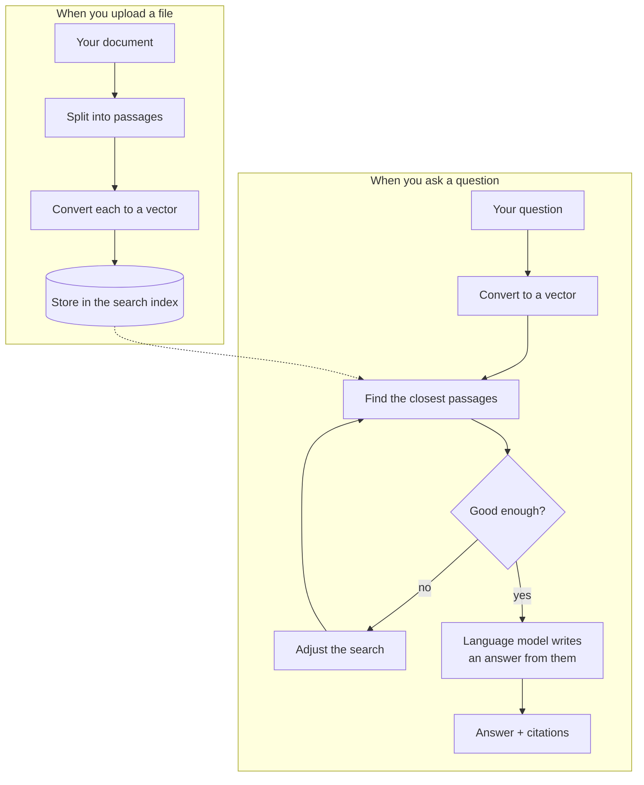

# Multilingual RAG

**Chat with your own documents — in any language.**

Upload a PDF, a Markdown file, or a text document into a chat, then ask questions about it. You get
a real answer with **citations pointing back to the exact passage** it came from, streamed word by
word like ChatGPT.

The part that makes it unusual: **the language you ask in doesn't have to match the language of
your documents.** Ask in English about a Hindi document and it works. You can even type Hindi using
English letters — `bharat ki rajdhani kya hai` — and it figures that out too.

And it costs nothing to run. No OpenAI bill, no paid API key.

---

## What problem does this actually solve?

Large language models are confident liars. Ask one about *your* company handbook and it will
happily invent an answer, because it has never seen your handbook.

The fix is a technique called **RAG** (Retrieval-Augmented Generation), and it works in two steps:

1. **Retrieve** — search your documents for the handful of passages most relevant to the question
2. **Generate** — hand *only those passages* to the language model and say "answer using this"

The model stops guessing, because the facts are sitting right in front of it. And because you know
which passages were used, every answer can cite its sources — so you can check them.

This project is a complete, working implementation of that idea, with a web app on top.

---

## What you can do with it

| | |
|---|---|
| 💬 **Chat naturally** | Multiple conversations, saved history, answers streamed as they're written |
| 📎 **Attach files to a chat** | Click the paperclip next to the message box. That file grounds *only that conversation* |
| 🔒 **Keep chats separate** | A document in one chat is invisible to every other chat. Delete the chat, the document goes with it |
| 🌍 **Mix languages freely** | Ask in English, get answers from Chinese, Hindi, Arabic, or Thai documents |
| 🔤 **Type Indic languages in English letters** | Romanized Hindi is detected and converted automatically. Kannada and Telugu are available too |
| 💬 **Ask follow-ups** | "What about the second one?" works — it understands what you're referring to |
| 📎 **Verify every claim** | Answers carry numbered citations linking back to the source passage — and you should use them, see the honest limitation below |

---

## Quick start

You need [Docker](https://www.docker.com/products/docker-desktop/) installed. That's it.

```bash
cp .env.example .env
docker compose up --build
```

Then open **http://localhost:3000** and sign up.

> **One optional step for full functionality.** Searching your documents works immediately, but
> *writing answers* needs a language model. Grab a **free** key from
> [build.nvidia.com](https://build.nvidia.com) (no credit card) and put it in `.env` as
> `GENERATION_API_KEY=...`. Any OpenAI-compatible provider works — see
> [Choosing a language model](#choosing-a-language-model).

**Be patient on the very first run.** It downloads the ~2.2 GB search model. After that it starts
in seconds, because the model is cached.

That single command starts five pieces: the web app, the API, a background worker that processes
uploads, a Postgres database, and Redis.

---

## How it works

Two things happen at different times: documents get **prepared** when you upload them, and
**searched** when you ask a question.



That "good enough?" check is the agent — see [below](#the-agent-noticing-when-a-search-went-badly).

### The key idea: meaning becomes coordinates

Every passage is converted into a long list of numbers — a **vector** — that represents its
meaning. Similar meanings land close together in that space.

This is why cross-language search works. A model called **bge-m3** was trained so that "capital of
India" in English lands in nearly the same place as the same phrase in Hindi or Chinese. Searching
is then just geometry: turn the question into a vector, find the nearest passages.

### Splitting documents is harder than it looks

Documents get cut into overlapping passages ("chunks") small enough to fit in the model's context.

The obvious approach — split on spaces — quietly breaks for much of the world. Chinese, Japanese,
and Thai **don't put spaces between words**, so a whole Chinese document would collapse into one
giant chunk and become unsearchable. This project counts *tokens* using the same tokenizer the
search model uses, so every language chunks correctly.

### Uploads happen in the background

Processing a large PDF can take minutes, so uploading doesn't make you wait. The upload returns a
job ID immediately, a background worker does the slow work, and the UI polls until it's done.

---

## The multilingual story

This was the hardest part to get right, and it's where the interesting engineering lives.

### Typing Hindi with English letters

Millions of people type Hindi phonetically in the Latin alphabet — `bharat ki rajdhani kya hai`
instead of `भारत की राजधानी क्या है`. Search engines handle this. Most RAG systems don't.

Here's why it breaks: the meaning-vector model relies heavily on the **script**. Latin-typed Hindi
looks like gibberish to it — not Hindi, not English — so it lands in the wrong region of the vector
space entirely. Measured against a Hindi document collection, it found the right passage only **20%**
of the time.

The fix is a detour rather than a bigger model. Before searching, the system:

1. **Notices** the query is romanized Hindi (by spotting distinctly-Hindi function words like *kya*,
   *hai*, *ki* — fast, local, no network)
2. **Converts** it to Devanagari script
3. **Searches** using that native-script form

Accuracy went from **20% → 67%** — more than 3× better. Plain English queries are left completely
untouched, so nothing else regresses.

**Kannada and Telugu** are supported the same way and are off by default. Turning them on uses a
small trained classifier that runs locally (no network calls, no per-query cost) and correctly
identifies the language ~96–97% of the time with zero false positives on English.

### Why there's no reranker

A common RAG upgrade is a "reranker" — a second, slower model that reorders results. This project
deliberately doesn't have one, and that was a measured decision, not an oversight.

An early experiment compared two search models on how often the *very first* result was correct:

| Model | First result correct (English → Chinese) |
|---|---|
| e5 | 30% — needs a reranker to fix the ordering |
| **bge-m3** | **67%** — already ordered well |

bge-m3 ranked well enough on its own that a reranker would have added cost and latency for little
gain. An entire planned milestone was cancelled because the data said it wasn't needed. The same
reasoning applies to keyword (BM25) search — it's noted as optional, not missing.

---

## Choosing a language model

The system talks to any provider that speaks the **OpenAI API format**, which is nearly all of them.
Switching providers is a URL change in `.env`, not a code change.

| Provider | Cost | Set `GENERATION_BASE_URL` to |
|---|---|---|
| **NVIDIA NIM** (default) | Free tier, no card | `https://integrate.api.nvidia.com/v1` |
| OpenRouter | Free tier available | `https://openrouter.ai/api/v1` |
| Groq | Free tier, very fast | `https://api.groq.com/openai/v1` |
| Ollama | Free, fully offline | `http://localhost:11434/v1` |
| OpenAI | Paid | `https://api.openai.com/v1` |

Searching your documents is always free and always local — only answer-writing calls a provider.

---

## Configuration

Everything lives in `.env` (copy it from `.env.example`). The settings you're most likely to touch:

| Setting | What it does |
|---|---|
| `GENERATION_API_KEY` | Your language-model key. Without it, search works but answers don't |
| `GENERATION_MODEL` | Which model writes answers (default: Llama 3.1 8B) |
| `TRANSLITERATION_LANGUAGES` | Set to `hi,kn,te` to enable Kannada and Telugu |
| `TRANSLITERATION_DETECTOR` | `word-list` (default, Hindi only) · `muril` (local, adds kn/te) · `google` |
| `EMBEDDING_PROVIDER` | `bge-m3` (local, free, default) or `openai` |
| `JWT_SECRET_KEY` | Login-token signing key. **Must** be changed for real deployments |
| `RETRIEVAL_TOP_K` | How many passages to feed the model (default: 8) |
| `RELEVANCE_GRADER` | How the agent judges a search: `llm` (default — never fabricates, but refuses a lot) or `score-threshold` (free, 1 call instead of ~3, answers more but makes things up 61% of the time on out-of-corpus questions) |
| `RELEVANCE_SCORE_THRESHOLD` | Only used by `score-threshold`. Below this score a search counts as weak and triggers a retry. Default `0.0` = only retry on an empty result; higher values were measured and made things worse |
| `AGENT_MAX_REPAIRS` | How many retries per question (default: 1 — raising it multiplies cost) |
| `GROUNDING_GATE` | Judge the finished answer against its passages and refuse if unsupported. Off — measured, and dominated by both grader settings at every query mix |

---

## Running it for development

The Docker route above is the easy one. To work on the code itself, run the pieces directly:

```powershell
# 1. Install (Python 3.13)
py -3.13 -m venv .venv
.\.venv\Scripts\Activate.ps1
python -m pip install -e ".[dev]"

# 2. Databases only — the rest you run by hand
docker compose up -d postgres redis
alembic upgrade head
```

Then, in **separate terminals**:

```powershell
python -m uvicorn multilingual_rag.api.app:app --port 8000    # the API
celery -A multilingual_rag.workers.celery_app.celery_app worker --pool=solo   # processes uploads
cd frontend; npm install; npm run dev                          # the web app
```

> ⚠️ **Don't skip the worker.** Without it, uploads sit in "queued" forever with no error — the
> single most confusing failure mode in this project.

### Checks

All three must pass; CI runs them on every push:

```powershell
python -m pytest              # ~160 tests
python -m ruff check .        # style + lint (--fix to autofix)
python -m mypy src            # type checking, strict mode
```

Two test groups are skipped unless available: model tests (`RUN_MODEL_TESTS=1`) and database tests
(run automatically when Postgres is reachable).

### Measuring quality

Retrieval quality is measured, not guessed. The harness runs the real pipeline over a public
multilingual question-answering dataset and is free to run — no API calls:

```powershell
# Score retrieval across languages (recall, MRR, nDCG)
python -m multilingual_rag.evaluation.run --live --langs en zh --k 5

# Specifically test the romanized-Hindi path
python scripts/eval_romanized.py --sample 150
```

---

## API

Everything sits under `/v1` and needs a login token except the health checks.

| Purpose | Endpoint |
|---|---|
| Health / readiness | `GET /healthz` · `GET /readyz` |
| Accounts | `POST /v1/auth/signup` · `/login` · `/refresh` |
| Conversations | `POST GET /v1/chats` · `GET PATCH DELETE /v1/chats/{id}` |
| Send a message | `POST /v1/chats/{id}/messages` |
| Files in a chat | `POST GET /v1/chats/{id}/documents` · `DELETE .../{doc_id}` |
| Upload progress | `GET /v1/ingestion-jobs/{job_id}` |
| One-off search | `POST /v1/query` |

A query like `{ "query": "bharat ki rajdhani kya hai", "top_k": 5 }` returns the answer, its
citations, the passages used, and — for romanized input — the converted form so you can see what
was actually searched.

---

## Project layout

```text
src/multilingual_rag/
  api/          HTTP endpoints
  chat/         conversations and messages
  ingestion/    reading files, splitting into passages
  embeddings/   turning text into vectors (bge-m3, OpenAI)
  vectorstores/ the search index (ChromaDB)
  retrieval/    finding relevant passages for a question
  generation/   prompting the model, parsing citations
  transliteration/  romanized Hindi/Kannada/Telugu handling
  agent/        the retrieval graph — grades its own results and retries
  evaluation/   quality measurement
frontend/       Next.js web app
docs/           architecture, decisions, experiment write-ups
```

**Built with:** Python 3.13 · FastAPI · LangGraph · Postgres · Redis · Celery · ChromaDB ·
sentence-transformers · Next.js 16 · React 19 · Tailwind

The codebase follows a **ports-and-adapters** structure: every external system (the vector database,
the embedding model, the language model) sits behind an interface. That's why swapping providers is
a config change, and why tests can run without a database or a 2 GB model.

---

## Deploying

The same `docker compose up --build` works on a server. Before exposing it publicly:

```bash
ENVIRONMENT=production
JWT_SECRET_KEY=<a long random string>   # python -c "import secrets; print(secrets.token_urlsafe(48))"
CORS_ALLOW_ORIGINS=https://your-domain.com
```

The app **refuses to start** in production with a weak or default secret — a deliberate guard
against the most common deployment mistake.

> **Upgrading from an older version?** You'll need to re-upload documents. Stored vectors are tagged
> with both a user and a chat, and older ones lack those tags, so they're ignored by design. Clear
> `data/chroma` and re-upload inside a chat.

---

## The agent: noticing when a search went badly

A plain RAG system searches **once** per question. If that search comes back weak, it answers from
weak passages anyway — it has no way to notice.

This one grades its own search results and retries when they look poor. The interesting part is
*how* it retries. Rather than generically rephrasing, it first asks **"did I guess the script
wrong?"** — because for a romanized query like `bharat ki rajdhani kya hai`, converting to
Devanagari is exactly the step that can fail. So it falls back to searching the original wording,
or tries a different Indic language, before spending a model call on a rewrite.

You can watch it work: the chat shows what it's doing as it goes, then collapses to a summary.

```
✓ Understanding your question
✓ Recognizing the language      · Hindi, typed in English letters
✓ Searching your documents      · 8 passages found
⚠ Didn't find much — trying again · rephrasing the search
✓ Searching again               · 6 passages found
✓ Writing the answer
```

By default the "was that good enough?" check is a real model call, and it fires on nearly every
query — so a normal answer costs about three calls, not one. `RELEVANCE_GRADER=score-threshold`
makes the check free and cuts that to one, at the cost described under
[the honest limitation](#the-honest-limitation-it-refuses-a-lot-of-questions-it-could-answer).

### What it measures out at — and why that's a "no change"

Measured on the full corpus — 150 questions against 20,240 documents:

| | retention vs native |
|---|---|
| Devanagari question (the ceiling) | 1.000 |
| Typed in English letters, searched as-is | 0.326 |
| Converted to Devanagari first | 0.852 |
| **Without the agent** | **0.852** |
| **With the agent** | **0.852** |

*Both agent rows were measured with `RELEVANCE_GRADER=score-threshold`, which was the default at
the time. The default is now `llm`, chosen on refusal quality rather than retrieval — it has not
been re-measured on this benchmark, and it would score worse here, because XQuAD contains only
answerable questions and this grader's whole behaviour is to refuse.*

Parity. The agent doesn't improve retrieval here, and the reason is worth stating plainly: the
check can't reliably tell *"this search failed"* from *"this search worked but scored low."* Those
two overlap almost completely. Every threshold that catches real failures also condemns correct
answers — and the retry it triggers is worse than what it replaced, so the agent scored **below**
the plain pipeline until the default was pulled back to "only retry when the search returned
literally nothing."

So the agent is a **safety net, not a boost**: it cannot make retrieval worse (it keeps the best
attempt, never merely the last), it catches the empty-result case, and it refuses honestly instead
of inventing an answer. What it genuinely bought was structural — one orchestration where there
were three, and tenancy that a prompt can't talk its way past.

### The honest limitation: it refuses a lot of questions it could answer

Ask something your documents *do* cover and, **about 70% of the time, it says it can't find it
anyway**. That is the price of the default, and it is deliberate.

The alternative is worse. With the free `score-threshold` grader, asking something the documents
*don't* cover gets an answer **61% of the time** — invented from the model's own knowledge, with a
citation pointing at whichever passage ranked highest. The citation looks like evidence and isn't.
A confident fabrication that cites a source is a worse thing to ship than an unhelpful "I don't
know", so the default is the one that never does it.

Measured with `scripts/eval_refusal.py`, 20 questions per set:

| setting | makes things up | refuses answerable | calls/turn |
|---|---|---|---|
| `RELEVANCE_GRADER=llm` (default) | **0%** | 70% | ~3 |
| `RELEVANCE_GRADER=score-threshold` | 61% | **21%** | 1 |
| `GROUNDING_GATE=true` | 40% | 55% | 2 |

There is no free point between them, and three separate attempts to find one have been measured
and reverted:

1. **Keep the grader's judgement but answer anyway** when retrieval isn't empty — hallucination
   returns immediately (0% → 55%). The grader avoids fabricating *by declining to answer*; that is
   the entire mechanism, so you cannot keep the safety and drop the refusals.
2. **Judge the finished answer** instead of the retrieval (`GROUNDING_GATE`) — dominated at every
   query mix: better than `score-threshold` only below a 38% answerable share, better than `llm`
   only above 73%, and those ranges don't overlap.
3. **Ask the judge a better question** — the model is right 7/8 about a *single* passage but fails
   at picking one out of five, so the set-level yes/no was the obvious suspect. Asking *which*
   passages help cut false refusals 70% → 50%, and pushed fabrication 0% → 20%. It made the judge
   more permissive rather than more accurate.

Attempt 3 is the informative one: it means **prompting is now ruled out by evidence rather than
untried**, and a stronger judge model is the only route left. It also produced the most useful
correction in this project — "the refusal policy is unchanged, so hallucination can't rise" is
false reasoning. Policy decides what happens *given* a weak grade; it has no bearing on how often
weak grades occur.

**Which default is right depends on your corpus.** The two graders cross at roughly a 55%
answerable share. If your users mostly ask about a document they just uploaded, `score-threshold`
is the better product and a one-line change. This project picks the side that never invents a
citation.

Notably, **no automated test caught the original problem** — every metric ran on a benchmark where
every question has an answer, so a hallucination rate and a good recall score coexisted happily.
It took someone uploading a document and asking an unrelated question.

### The bug this exercise found

Building that evaluation turned up something more valuable than the feature. The harness had been
generating its romanized test queries with the *same library* as one of the transliteration
adapters it was scoring — marking its own homework, worth about +0.25 recall to that adapter. It
also produced text nobody types: `josa narmana` where a person writes `josh norman`.

Queries now come from **human-written** romanizations (Google's Dakshina dataset plus a parallel
corpus). Fixing it revealed the multilingual path was substantially better than this README had
been claiming — romanized retention went from a reported 0.669 to **0.852** — and simultaneously
invalidated the justification for a feature that had just been built, which was then removed.

Reproduce it (~40 minutes; the full corpus, no shortcuts):

```powershell
python scripts/eval_romanized.py --sample 150 --report data/eval/reports/hi-full-baseline.json
```

A smaller `--distractor-cap` runs faster but **inflates the score** — 3,240 documents reads 0.917
where the full 20,240 reads 0.852 — so the acceptance gate deliberately refuses to grade a
shortened run.

---

## Learn more

| Document | What's in it |
|---|---|
| [`docs/architecture.md`](docs/architecture.md) | System design, request flows, every bug found and how it was fixed |
| [`docs/progress.md`](docs/progress.md) | What's built, in what order, and why |
| [`docs/m0/report.md`](docs/m0/report.md) | The experiment behind choosing bge-m3 |
| [`docs/indic-romanized-spike.md`](docs/indic-romanized-spike.md) | The romanized-Hindi investigation |
| [`docs/skills.md`](docs/skills.md) | Technical background and project-specific gotchas |
