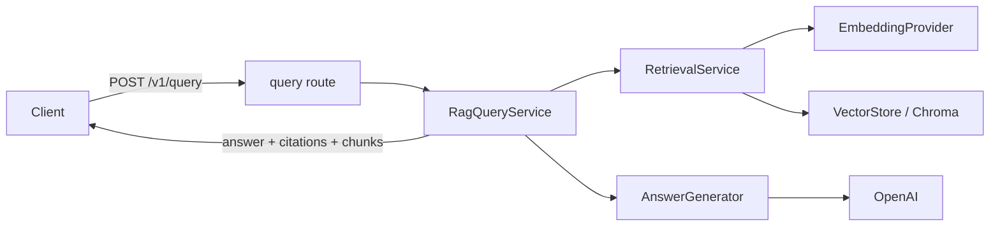
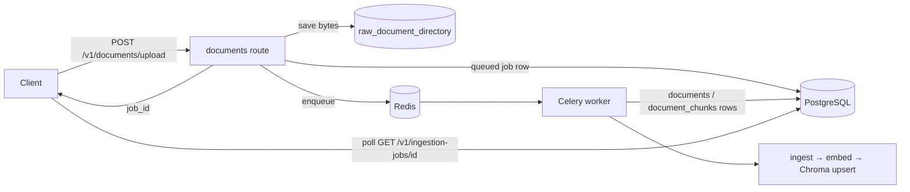
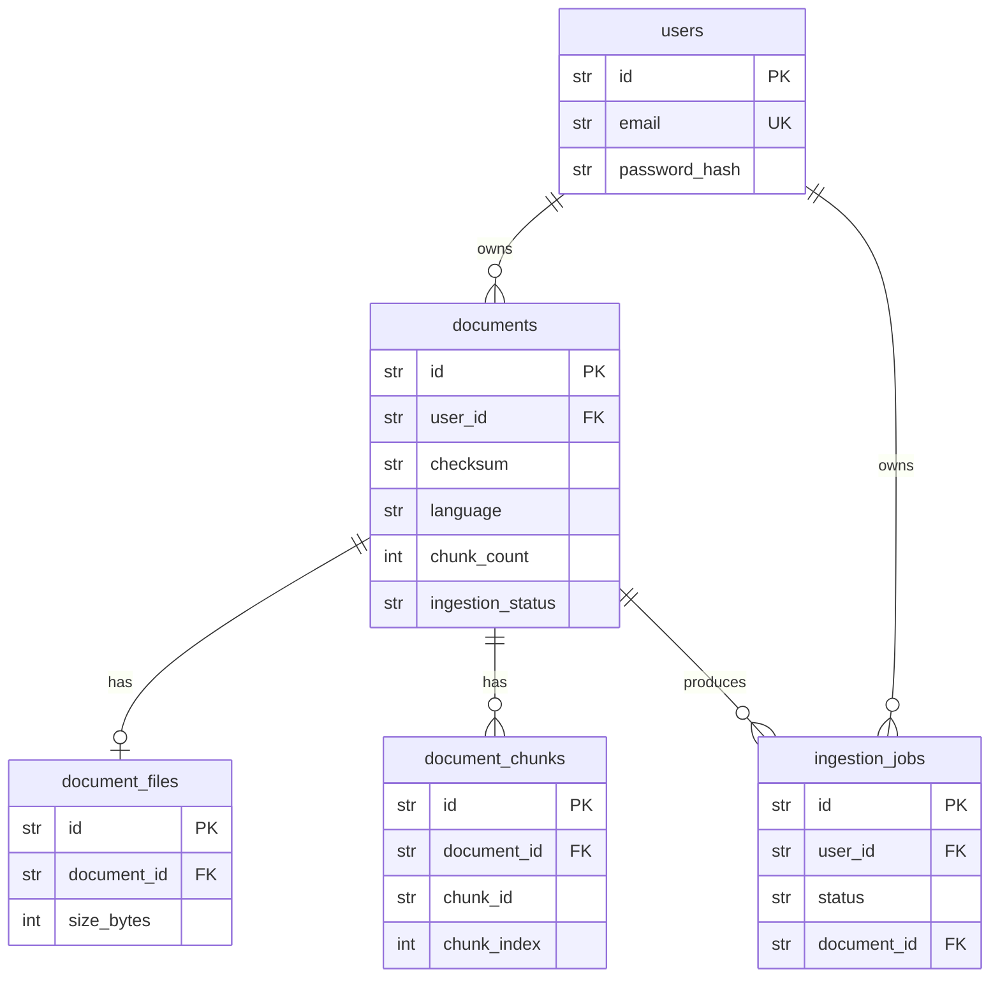

# Architecture — Multilingual RAG

Retrieval-augmented generation over multilingual documents. A user uploads documents in any
language, they are chunked / embedded / indexed, and the user asks questions (in any language)
and receives grounded, cited answers.

This document describes the system **as it exists today**. Known defects and the planned
repair are called out explicitly in [§7](#7-known-defects--planned-evolution); do not read the
current design as the intended end state.

---

## 1. High-Level Design

### 1.1 One rule: layers depend downward, externals sit behind ports

```text
HTTP request
   │
   ▼
 Route  (api/routes/*)            ← async; validation, auth, response shaping
   │
   ▼
 Service  (retrieval, documents, ingestion, auth)   ← orchestration
   │
   ▼
 Protocol-typed adapter          ← the only thing that talks to an external system
   │
   ▼
 External:  OpenAI · ChromaDB · PostgreSQL · Redis
```

Every external system is reached through a `Protocol` "port"; concrete "adapters" implement
it. Services receive ports by keyword-only constructor injection and never import an adapter
directly. This is what makes the embedding-model swap (OpenAI → bge-m3) a one-adapter change.

| Port (`Protocol`) | File | Adapter |
|---|---|---|
| `EmbeddingProvider` | `embeddings/base.py` | `OpenAIEmbeddingProvider` |
| `VectorStore` | `vectorstores/base.py` | `ChromaVectorStore` |
| `AnswerGenerator` | `generation/base.py` | `OpenAIAnswerGenerator` |

### 1.2 Sync core, async edge

The entire RAG core — ingestion, chunking, embedding, vector I/O, retrieval, generation — is
**synchronous**. Only the API, the DB session, and the repository layer are `async`.

- `RagQueryService.answer_query` is a **sync** method called from an **async** route.
- The Celery worker bridges back to async with `asyncio.run()` (`workers/celery_app.py:25`).

> This is a deliberate current-state choice, and it is also a known limitation: sync network
> I/O on the event loop serializes concurrent queries (see §7). Phase D converts the core to
> async.

### 1.3 Request flows

**Query (synchronous RAG):**



**Upload (asynchronous ingestion):**



The upload endpoint does **not** index inline. It saves bytes, writes a `queued` job, enqueues
Celery, and returns a `job_id`. The worker runs `documents/jobs.py::run_ingestion_job`. Clients
poll `GET /v1/ingestion-jobs/{job_id}`.

### 1.4 Two document paths coexist

| Path | Storage | Scoping | Status |
|---|---|---|---|
| `DatabaseDocumentIndexingService` | PostgreSQL + Celery | per-`user_id` | **preferred** — what the routes use |
| `DocumentIndexingService` + `DocumentStore` | JSON file (`data/document_store.json`) | none | legacy; still tested; slated for deletion |

### 1.5 Identity & tenancy

JWT bearer via `auth/dependencies.py::get_current_user`. Password hashing is hand-rolled
PBKDF2-HMAC-SHA256 in `auth/security.py` (format `pbkdf2_sha256$iterations$salt$digest`,
310k iterations, `hmac.compare_digest`) — no passlib.

**Tenancy (Phase A).** `/v1/query` requires authentication, and `user_id` is a required
keyword-only argument on the `VectorStore` protocol (`upsert_chunks`/`search`/`delete_document`)
— a forgotten call site is a mypy error, not a silent leak. `ChromaVectorStore` scopes search
with `{"$and": [{"user_id": …}, <client filters>]}` (un-widenable), namespaces storage ids as
`{user_id}:{chunk_id}` so identical cross-user uploads don't collide, and rejects a client
`user_id` filter (`reserved_filter_key`). Content-addressed dedup that supersedes the
namespacing is Phase D (D6).

### 1.6 Tech stack & data stores

- **Python 3.13**, FastAPI, Pydantic v2 (+ pydantic-settings)
- **PostgreSQL** via SQLAlchemy 2.x async + asyncpg; migrations by **Alembic**
- **ChromaDB** (embedded `PersistentClient`, cosine) — the vector store
- **Redis** + **Celery** — async ingestion broker/result backend
- **OpenAI** — embeddings (`text-embedding-3-small`) and generation (`gpt-4.1-mini`)
- **langdetect** — language detection
- Verification: pytest, ruff (line length 100), mypy `strict`

---

## 2. Low-Level Design — module map

```text
api/          HTTP boundary
  app.py                 create_app() factory; single AppError→ErrorResponse handler
  schemas.py             ErrorResponse
  routes/                health · auth · documents (+ jobs_router) · query
auth/         identity
  security.py            PBKDF2 hashing, JWT encode/decode
  service.py             signup / login orchestration
  repository.py          UserRepository (async)
  dependencies.py        get_current_user (bearer → UserRecord)
core/         cross-cutting
  config.py              Settings (pydantic-settings), get_settings() lru_cache
  models.py              all domain models — frozen, tuple-valued
  errors.py              AppError(message, code, status_code)
  logging.py             configure_logging (JSON)
ingestion/    parse → detect → chunk (sync)
  loaders.py             txt/md/html/pdf/docx → LoadedDocument
  language.py            LanguageDetector (langdetect, seeded)
  chunker.py             TextChunker — overlapping token windows
  service.py             IngestionService.ingest_file → IngestionResult
  service_utils.py       checksum_text
embeddings/   port + adapter
  base.py                EmbeddingProvider protocol
  openai_embeddings.py   batched embeddings, single-query embedding
vectorstores/ port + adapter
  base.py                VectorStore protocol; MetadataValue / VectorFilter types
  chroma_store.py        cosine; score = 1.0 - distance; meta_-prefixed custom metadata
retrieval/    query-time
  service.py             RetrievalService.retrieve → RetrievalContext
  context.py             format_context — numbers chunks [1] [2] … for citation
generation/   port + adapter
  base.py                AnswerGenerator protocol
  openai_generator.py    OpenAI Responses API adapter
  prompts.py             SYSTEM_INSTRUCTIONS + build_answer_prompt
documents/    DB-backed document lifecycle (async)
  service.py             DatabaseDocumentIndexingService + legacy DocumentIndexingService
  repository.py          DocumentRepository, IngestionJobRepository
  jobs.py                run_ingestion_job (the Celery task body)
storage/      legacy
  document_store.py      DocumentStore — JSON file, atomic tmp+replace
db/           persistence
  base.py / session.py   async engine + AsyncSessionFactory (engine at import time)
  models.py              ORM tables
  init.py                create_database_schema (tests/dev only)
workers/
  celery_app.py          Celery app + ingest_document task (asyncio.run bridge)
evaluation/   offline metrics
  metrics.py             recall@k, reciprocal_rank, dcg/ndcg@k, language_match_rate
  datasets.py            EvaluationExample, load_jsonl_dataset
  run.py                 report CLI
```

### 2.1 Domain models (`core/models.py`)

Every model is **frozen** (`ConfigDict(frozen=True)`) and collections are **`tuple[...]`**, not
`list`. This immutability propagates through every service signature and response model.

`DocumentMetadata` · `DocumentSection` · `LoadedDocument` · `DocumentChunk` · `IngestionResult`
· `VectorSearchResult` · `RetrievalContext` · `AnswerCitation` · `GeneratedAnswer` ·
`DocumentRecord` · `UserRecord` · `IngestionJobRecord`.

### 2.2 Dependency injection — `app.state` is the seam

This codebase does **not** use FastAPI `dependency_overrides`. Each route has a module-level
`get_*_service(request, …)` helper that returns `request.app.state.<attr>` if present, else
constructs the real dependency. Tests attach fakes to `app.state`:

```python
app = create_app(Settings(environment="test"))
app.state.query_service   = FakeQueryService()
app.state.document_service = FakeDocumentService()
app.state.current_user    = UserRecord(user_id="user-1", email="u@example.com")
app.state.enqueue_ingestion = enqueued_jobs.append   # bypass Celery
```

Recognized attrs: `settings`, `query_service`, `document_service`, `current_user`,
`enqueue_ingestion`. There is no `conftest.py`; fakes are plain classes, not mocks.

> Consequence worth knowing: every route integration test injects a fake service, so the real
> `DatabaseDocumentIndexingService`, both repositories, and `run_ingestion_job` currently have
> **zero test coverage**.

### 2.3 Error handling

Raise `AppError(message, code="snake_case_code", status_code=...)`, never `HTTPException`. A
single handler in `api/app.py` renders it as `ErrorResponse`. The `code` is part of the API
contract.

### 2.4 Configuration

`Settings` is injected as an object, never read from env at use sites. Routes reach it via
`cast(Settings, request.app.state.settings)`; services take it as a constructor arg.
`get_settings()` is `lru_cache`d. **Import-time side effect:** `db/session.py` and
`workers/celery_app.py` call `get_settings()` and build engines at module import — importing
anything that transitively pulls in `db.session` reads `.env` and constructs an async engine.

### 2.5 Database schema (`db/models.py`)



- `document_chunks` **mirrors** Chroma metadata for traceability — chunk writes must stay in
  sync with vector upserts.
- `chat_sessions`, `messages`, `message_citations` exist as ORM tables but are **unused
  placeholders** for a future chat milestone — not dead code.
- **No FK carries `ondelete`** (see §7).

### 2.6 Vector store specifics (`vectorstores/chroma_store.py`)

Cosine space; `score = 1.0 - distance`. Chroma metadata must be flat scalars, so custom chunk
metadata is stored `meta_`-prefixed and unwrapped on read. Document IDs are derived in
`ingestion/service.py` via `uuid5(NAMESPACE_URL, f"{source_path}:{checksum}")`.

### 2.7 Migrations

`alembic/env.py` ignores `sqlalchemy.url` in `alembic.ini` and derives the URL from
`get_settings().database_url`, rewriting the async driver to sync
(`postgresql+asyncpg` → `postgresql`). Configure migrations through `DATABASE_URL`.

---

## 3. Evaluation (M0 outcome baked in)

`data/eval/xquad/` holds the cross-lingual eval corpus (XQuAD gold + queries, committed;
distractors regenerated by `scripts/build_eval_corpus.py` from pinned dataset revisions +
`SEED=42`). The M0 thesis spike measured cross-lingual retrieval and selected **`bge-m3`** over
`multilingual-e5-large`. Full result: `docs/m0/report.md`. The current code still uses OpenAI
embeddings; the swap is Phase C.

---

## 4. Key design decisions (why, not just what)

| Decision | Rationale |
|---|---|
| Ports & adapters everywhere | Swap any external (embed model, vector DB, LLM) without touching services or tests |
| Frozen models + tuples | Kill a whole class of aliasing/mutation bugs across layers |
| `app.state` DI over `dependency_overrides` | Tests build a real app and hang plain fakes off state; no mock framework |
| `AppError` over `HTTPException` | Stable machine-readable `code` as API contract; one render site |
| Async ingestion via Celery | Uploads return immediately; embedding/indexing runs off the request |
| `document_chunks` mirrors Chroma | Traceability / debuggability of what was indexed |

---

## 5. Environments

`docker compose up` brings up postgres + redis + api + worker. `OPENAI_API_KEY` is required
for embedding/generation paths. Postgres and Redis must be running for anything touching
documents or auth.

---

## 6. Directory reference

```text
src/multilingual_rag/   application (see §2 map)
alembic/                migrations (0001_initial_schema)
scripts/                smoke_test.py · build_eval_corpus.py
data/eval/              sample_qa.jsonl (legacy fixture) · xquad/ (M0 corpus)
docs/                   architecture.md · skills.md · progress.md · m0/report.md
tests/                  unit/ · integration/ (no conftest.py)
```

---

## 7. Known defects & planned evolution

These are documented so the current architecture is not mistaken for the target. The repair is
the fix-in-place plan (Phases A–D); status is tracked in `docs/progress.md`.

| # | Defect (current state) | Fix |
|---|---|---|
| ~~Security~~ ✅ | ~~`POST /v1/query` unauthenticated; Chroma has no `user_id`~~ — **fixed in Phase A**: query requires a bearer token, chunks carry `user_id`, search/delete are user-scoped, storage ids namespaced by user | A ✅ |
| ~~Security~~ ✅ | ~~default prod secret; uncapped uploads~~ — **fixed in Phase A**: `Settings` refuses the placeholder secret in prod/staging; uploads capped at `max_upload_bytes` (413) | A ✅ |
| ~~Quality~~ ✅ | ~~cites every retrieved chunk~~ — **fixed in B**: `generation/citations.py` parses the model's `[n]` markers, cites only those | B ✅ |
| ~~Quality~~ ✅ | ~~`evaluation/run.py` scores a static fixture~~ — **fixed in B**: `--live` runs the real pipeline (bge-m3 + Chroma) over the XQuAD corpus | B ✅ |
| ~~Multilingual~~ ✅ | ~~`\S+` collapses CJK/Thai to one chunk~~ — **fixed in C1**: `TextChunker` windows over bge-m3 token ids (`ingestion/tokenizer.py`); a long Chinese doc now yields many chunks | C ✅ |
| ~~Multilingual~~ ✅ | ~~`"unknown"` language leaks into the prompt~~ — **fixed in C2**: `resolve_answer_language` falls back to evidence language, then `en` | C ✅ |
| ~~Model~~ ✅ | ~~still on OpenAI embeddings~~ — **fixed in C3**: bge-m3 (1024-dim, no prefixes) is the default via `embeddings/factory.py`; OpenAI stays available behind config | C ✅ |
| Runtime | Sync core blocks the event loop; clients built per-request in `get_query_service` | D |
| Runtime | Embedded Chroma shared by api + worker processes (SQLite writer contention) | D |
| Data | `DELETE /v1/documents/{id}` bulk-deletes bypassing ORM cascade; no FK `ondelete` → IntegrityError on real Postgres | D |
| Data | Dual write upserts Chroma before Postgres → orphan vectors on failure; dedup defeated by uuid4-in-path; file "checksum" hashes the path string | D |
| Testing | DB/worker layer has zero coverage (every route test injects a fake) | D |
