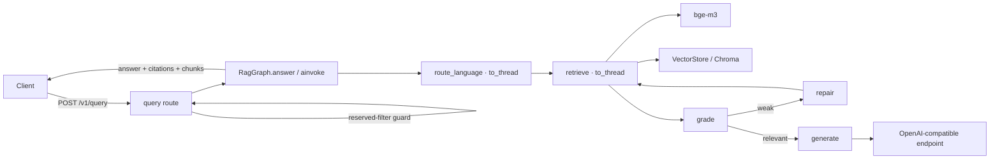
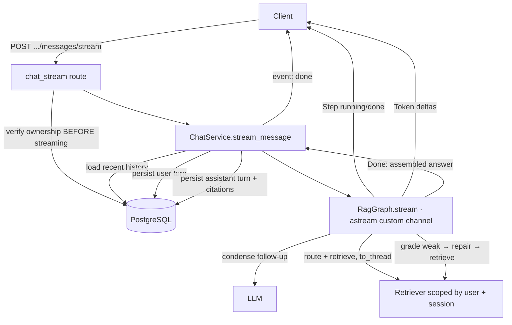
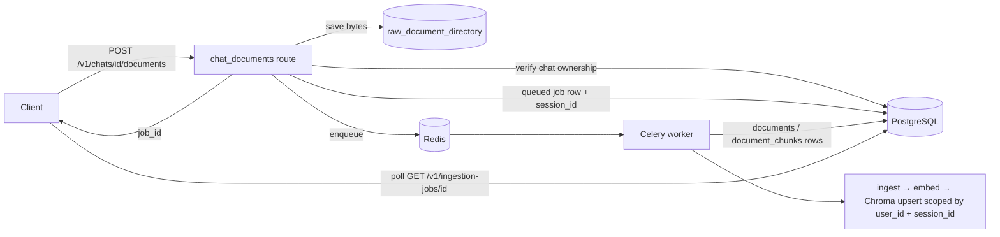
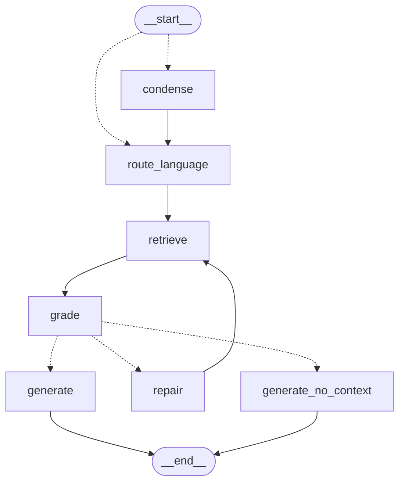
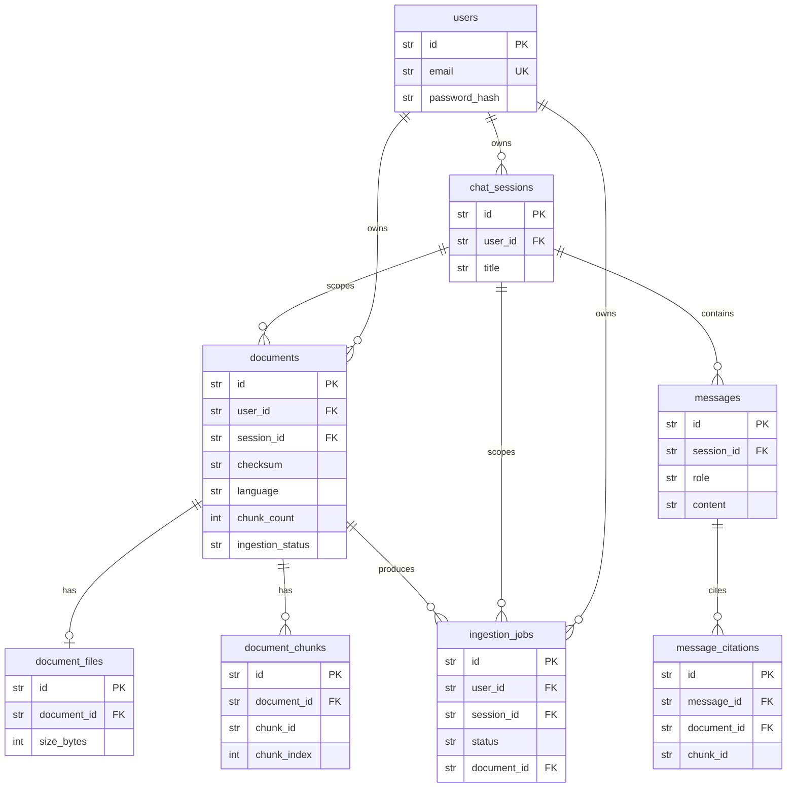

# Architecture — Multilingual RAG

Retrieval-augmented generation over multilingual documents. A user uploads documents in any
language into a chat, asks questions (in any language, including Indian languages typed in the
Latin alphabet), and receives streamed, grounded, cited answers.

This document describes the system **as it exists today**. Milestone status lives in
`docs/progress.md`; §9 keeps the defect record.

**Reading order if you're new to the codebase:** §1.1 (the one rule) → §1.3 (request flows) →
§2 (module map) → §4 (why, not just what).

---

## 1. High-Level Design

### 1.1 One rule: layers depend downward, externals sit behind ports

```text
HTTP request
   │
   ▼
 Route  (api/routes/*)            ← async; validation, auth, response shaping
   │
   ▼
 Service  (retrieval, chat, documents, ingestion, auth)   ← orchestration
   │
   ▼
 Protocol-typed adapter          ← the only thing that talks to an external system
   │
   ▼
 External:  bge-m3 · ChromaDB · OpenAI-compatible LLM · PostgreSQL · Redis
```

Every external system is reached through a `Protocol` "port"; concrete "adapters" implement it.
Services receive ports by keyword-only constructor injection and **never import an adapter
directly**. That is what made the embedding swap (OpenAI → bge-m3) a one-adapter change, and what
lets tests pass plain fakes with no mocking library.

| Port (`Protocol`) | Defined in | Adapters | Factory |
| --- | --- | --- | --- |
| `EmbeddingProvider` | `embeddings/base.py` | `BgeM3EmbeddingProvider` **(default)**, `OpenAIEmbeddingProvider` | `embeddings/factory.py` |
| `VectorStore` | `vectorstores/base.py` | `ChromaVectorStore` | `vectorstores/factory.py` |
| `AnswerGenerator` | `generation/base.py` | `OpenAICompatibleAnswerGenerator` | constructed in the query route |
| `StreamClient` | `generation/base.py` | `OpenAICompatibleStreamClient` | `agent/factory.py::build_stream_client` |
| `Transliterator` | `transliteration/base.py` | `google` **(default)**, `indicxlit`, `rule-based`, `llm` | `transliteration/factory.py` |
| `Retriever` | `retrieval/base.py` | `RetrievalService` | `agent/factory.py::build_retriever` |
| `RelevanceGrader` | `agent/grading/base.py` | `ScoreThresholdGrader` **(default, free)**, `LlmRelevanceGrader` | `agent/grading/factory.py` |

Each factory selects its adapter from `Settings` and imports it **lazily**, so a module that never
builds a vector store never pulls in `chromadb`, and the offline test suite never loads the 2.2 GB
embedding model.

### 1.2 Sync core, async edge

The RAG core — ingestion, chunking, embedding, vector I/O, retrieval — is **synchronous**. The API,
the DB session, the repository layer, and the **orchestrator** are `async`.

**Why:** local model inference is genuinely blocking. Marking it `async` would be a lie that stalls
the event loop. So the blocking work is offloaded *explicitly*.

**The bridge lives in the graph's nodes, not the routes.** Before the agent graph, a route
offloaded a whole sync orchestrator (`await asyncio.to_thread(query_service.answer_query, …)`).
Now each node offloads its own blocking call, and there is no `to_thread` in any route or in
`ChatService`. Two calls need it, not one — retrieval *and* routing:

| Node | Bridge | Why |
| --- | --- | --- |
| `route_language` | `await asyncio.to_thread(retriever.route, …)` | `detect_target_language` calls `asyncio.run` internally on the `google` detector path (`transliteration/detect.py:129-137`) — invoking it on a running loop raises `RuntimeError` |
| `retrieve` | `await asyncio.to_thread(retriever.retrieve, …)` | local bge-m3 embed + Chroma search |

The routing one is a trap worth naming: the default `word-list` detector takes no `asyncio.run`
path, so forgetting the offload would leave the whole test suite green and fail only in production
with `TRANSLITERATION_DETECTOR=google`. `tests/unit/test_agent_graph.py` asserts the routing call
does not run on the main thread.

The Celery worker still bridges the other way — `asyncio.run(...)` in `workers/celery_app.py`.

**Rule for new code:** keep core logic sync; keep `async` at the HTTP/DB boundary and in the graph.

### 1.3 Request flows

#### Query (blocking RAG) — `POST /v1/query`


```mermaid
flowchart LR
    C[Client] -->|POST /v1/query| Q[query route]
    Q -->|reserved-filter guard| Q
    Q --> G[RagGraph.answer / ainvoke]
    G --> RL[route_language · to_thread]
    RL --> RET[retrieve · to_thread]
    RET --> EMB[bge-m3]
    RET --> VS[VectorStore / Chroma]
    RET --> GR[grade]
    GR -->|weak| RP[repair] --> RET
    GR -->|relevant| GEN[generate]
    GEN --> LLM[OpenAI-compatible endpoint]
    G -->|answer + citations + chunks| C
```

No `asyncio.to_thread` at the route any more — the graph offloads per node (§1.2). Steps are
emitted but discarded: `ainvoke` installs a no-op stream writer, so this path costs nothing extra.

#### Chat message, streamed — `POST /v1/chats/{id}/messages/stream`


```mermaid
flowchart TD
    C[Client] -->|POST .../messages/stream| R[chat_stream route]
    R -->|verify ownership BEFORE streaming| PG[(PostgreSQL)]
    R --> CS[ChatService.stream_message]
    CS -->|load recent history| PG
    CS -->|persist user turn| PG
    CS --> G[RagGraph.stream · astream custom channel]
    G -->|condense follow-up| LLM[LLM]
    G -->|route + retrieve, to_thread| RET[Retriever scoped by user + session]
    G -->|grade weak → repair → retrieve| RET
    G -->|Step running/done| C
    G -->|Token deltas| C
    G -->|Done: assembled answer| CS
    CS -->|persist assistant turn + citations| PG
    CS -->|event: done| C
```

Steps and tokens share one `custom` stream channel and are discriminated by type; `ChatService`
re-wraps them as `StepChunk` / `TokenChunk`. Only the turns are persisted — steps are not.

Ownership is verified **before** the `StreamingResponse` opens — once headers are sent, a failure
can only be reported as an SSE `error` event, not an HTTP status.

#### Upload (asynchronous ingestion) — `POST /v1/chats/{id}/documents`


```mermaid
flowchart LR
    C[Client] -->|POST /v1/chats/id/documents| U[chat_documents route]
    U -->|verify chat ownership| PG[(PostgreSQL)]
    U -->|save bytes| RAW[(raw_document_directory)]
    U -->|queued job row + session_id| PG
    U -->|enqueue| RQ[(Redis)]
    U -->|job_id| C
    RQ --> W[Celery worker]
    W --> ING[ingest → embed → Chroma upsert scoped by user_id + session_id]
    W -->|documents / document_chunks rows| PG
    C -->|poll GET /v1/ingestion-jobs/id| PG
```

The upload endpoint does **not** index inline. It verifies chat ownership, reads at most
`max_upload_bytes + 1` (so nothing oversized ever enters memory), saves bytes, writes a `queued`
job scoped to that chat, enqueues Celery, and returns a `job_id`. The worker runs
`documents/jobs.py::run_ingestion_job`. Clients poll `GET /v1/ingestion-jobs/{job_id}`.

**Write ordering inside the job** — DB rows → vectors → **one** commit. On failure: rollback,
best-effort delete of any vectors that landed, mark the job failed. This keeps Postgres and Chroma
from drifting into orphan-vectors or document-without-vectors.

> **Subtlety:** `user_id`, `session_id`, and `file_path` are captured into plain locals *before*
> any rollback. A rolled-back ORM object can't be lazily re-read under async SQLAlchemy, and the
> cleanup path needs those values — the D5 test caught this silently no-op'ing.

### 1.4 One document path, scoped per chat

`DatabaseDocumentIndexingService` (PostgreSQL + Celery) is the only path. The legacy
`DocumentIndexingService` + `DocumentStore` (an unscoped JSON file) was removed in Phase D — a
single source of truth, no drift.

Since **M18** documents belong to a **single chat**, not the whole user: a file uploaded into a
chat grounds only *that* chat's answers.

- `documents` / `ingestion_jobs` carry a nullable `session_id` FK (`ondelete=CASCADE`, so deleting
  a chat drops its documents)
- dedup constraint is `(user_id, session_id, checksum)`
- the content-addressed `document_id` folds in `session_id`
- `session_id` threads through the `VectorStore` methods and retrieval → the agent graph, where it
  lives in `AgentState` and is re-read by every `retrieve` attempt, including after a repair

There is no user-wide document library and no global `/v1/documents` route.

**How it was verified:** chat A answered citing its uploaded document; chat B — same user, same
question — returned **no citations** and didn't know the fact. Citations come only from retrieved
chunks, so that is proof of scoping rather than an assumption.

### 1.5 Identity & tenancy

JWT bearer via `auth/dependencies.py::get_current_user`. Password hashing is hand-rolled
PBKDF2-HMAC-SHA256 in `auth/security.py` (format `pbkdf2_sha256$iterations$salt$digest`, 310k
iterations, `hmac.compare_digest`) — no passlib. Access tokens are short-lived (30 min) with a
`POST /v1/auth/refresh` sliding session.

**Tenancy is enforced server-side and is structurally un-widenable:**

- `user_id` is a **required keyword-only argument** on every `VectorStore` method — a forgotten
  call site is a mypy error, not a silent leak
- `scoped_where()` builds `{"$and": [{"user_id": …}, {"session_id": …}, …client filters]}` — client
  filters are AND-ed *underneath* the scope, so they can only narrow, never reach another tenant
- storage ids are namespaced `{user_id}:{session_id}:{chunk_id}`, so two chats holding the
  byte-identical file don't overwrite each other
- `/v1/query` rejects a client-supplied `user_id` filter (`reserved_filter_key`, 400)
- **Fails closed:** vectors without a `user_id` are invisible rather than leaked

**Content-addressed dedup:** `document_id = uuid5(NAMESPACE_URL, f"{user_id}:{session_id}:{checksum}")`
with a `(user_id, session_id, checksum)` unique constraint. Re-uploading identical content into the
same chat updates in place instead of duplicating. The old scheme mixed a per-upload `uuid4` path
into the id, so dedup never worked.

### 1.6 Romanized-Indic query path (detect → transliterate)

bge-m3 can't retrieve from **romanized** Hindi — the language signal lives in the script, so a
Latin-typed query (`bharat ki rajdhani kya hai`) collapses to ~0.20 recall against the
native-Devanagari index (measured; see `docs/indic-romanized-spike.md`). The fix is a query-side
**detect → transliterate → search** step in `RetrievalService.retrieve`.

**Detection, not dual-query — and the eval is why.** The first design searched *both* the raw and
transliterated forms and fused them. Every fusion strategy (max-cosine, RRF, confidence routing)
dragged romanized-Hindi recall *below* pure transliteration (~0.56 vs ~0.67): the raw search's
noise is irreducible when you can't tell which form is right. So
`transliteration/detect.py::detect_target_language` decides **whether** to transliterate, via a
cheap linguistic check — distinctly-Hindi function words (`kya`, `hai`, `kaun`, `nahi`) that
essentially never appear in English.

- Detected → embed and search the **transliterated** form only
- Not detected (plain English) → search the raw query untouched, so English stays same-language

**Measured (XQuAD-hi, 10k distractors, 150 queries, recall@5):**

| Condition | recall@5 |
| --- | --- |
| Native Devanagari | 0.947 |
| Romanized, raw | 0.204 |
| Romanized, transliterated | 0.676 |
| **Shipped (detect → transliterate)** | **0.669** |

**0.20 → 0.67 = 3.3×**; shipped ≈ the transliteration ceiling because detection recall is **98.7%**.

> ⚠️ **These numbers are superseded.** They were measured when the harness generated its romanized
> test queries with `indic_transliteration.sanscript` — the same library as the `rule-based`
> adapter under test (§3). On human-written romanized queries the same shipped path scores **0.917
> retention** (sampled: 60 queries / 3240 docs). The mechanism and the conclusion hold; the
> magnitudes were pessimistic because the queries were unlike real input. Re-derive on the full
> corpus before quoting a replacement.

**Precision is prioritized** — a false positive would mis-transliterate a real English query, which
is worse than missing a Hindi one. The marker list deliberately excludes English collisions (`the`,
`is`, `to`, `me`, `par`, `ka`). No false positives were observed on the English control set (40
queries).

**Detection returns the target *language*, not just yes/no** (`detect_target_language -> str|None`),
which is what enables Kannada/Telugu — `RetrievalService` transliterates to whichever script is
detected. Three detectors, selected by `TRANSLITERATION_DETECTOR`:

| Detector | Languages | Network | Notes |
| --- | --- | --- | --- |
| `word-list` **(default)** | hi | none | Function-word check; fast, local, no model |
| `muril` | hi/kn/te | none | Frozen `google/muril-base-cased` (mean-pooled 768-d) + committed multinomial LR head. Held-out hi 1.000 / kn 0.987 / te 0.920, 0 FP. ~950 MB model, lazy CPU load |
| `google` | hi/kn/te | per query | googletrans `detect()`; no training data needed |

Both multi-language detectors were validated on a Wikipedia-derived synthetic eval
(`scripts/build_indic_romanized_eval.py`): romanized→native recovery **kn 0.96 / te ~0.97**. Both
are opt-in, and **every detector falls back to the word list on failure** — a fresh checkout and the
test suite stay fast and model-free.

Native-script, CJK, and Thai queries have no Latin markers, so they skip the path entirely. The
response carries `transliterated_query` / `transliteration_applied`.

### 1.7 Multi-turn conversation context

A conversational follow-up ("who founded it?") embeds poorly — the referent lives in earlier turns.
Before retrieval, a small **condense** LLM call (`generation/contextualize.py`) rewrites it into a
self-contained question.

- The rewrite is used for **retrieval only**; the answer prompt still shows the user's actual
  wording (`context.model_copy(update={"query": query})`)
- The condense system prompt explicitly says *preserve the original language and script*, so
  romanized-Indic detection still fires on the rewritten query
- `chat_history_max_messages` (default 10, ~5 exchanges) bounds the history fed to both the
  condense call and the answer prompt
- Applies identically to both paths, because both are the same graph: condense is one node, and a
  conditional entry edge skips it entirely when there is no history

### 1.8 Tech stack & data stores

- **Python 3.13**, FastAPI, Pydantic v2 (+ pydantic-settings)
- **PostgreSQL** via SQLAlchemy 2.x async + asyncpg; migrations by **Alembic**
- **ChromaDB** (embedded `PersistentClient`, cosine) — the only vector store
- **Redis** + **Celery** — async ingestion broker/result backend
- **bge-m3** (local, 1024-dim, pinned revision) — default embeddings; OpenAI stays behind config
- **Any OpenAI-compatible chat endpoint** — generation (NVIDIA NIM by default, free tier)
- **Next.js 16** (App Router, React 19, Tailwind v4) — the frontend (`frontend/`)
- **langdetect** — language detection (seeded for determinism)
- **LangGraph 0.6** — the agent graph in `agent/` (§1.9). Pulls `langchain-core` → `langsmith`
  transitively; `LANGSMITH_TRACING=false` is set in `.env.example` and CI so no tracing thread
  ever starts
- Verification: pytest, ruff (line length 100), mypy `strict`; GitHub Actions CI runs all three
  plus the frontend lint/build

### 1.9 Agentic orchestration (`agent/`)

**The only orchestration.** All three entry points go through `RagGraph`, obtained from
`api/dependencies.py::get_rag_graph`. Nothing outside `agent/` imports LangGraph.

**Why it exists.** The same condense → retrieve → generate pipeline used to be written three
times:

| Route | Was | Now |
| --- | --- | --- |
| `POST /v1/query` | `RagQueryService.answer_query` (sync) | `RagGraph.answer` |
| `POST /v1/chats/{id}/messages` | `RagQueryService.answer` (sync) | `RagGraph.answer` |
| `POST /v1/chats/{id}/messages/stream` | `StreamingAnswerGenerator.stream` (async) | `RagGraph.stream` |

Two of them duplicated the same seven steps, held together by a
`cast(RagQueryService, …).retrieval_service` reach-through in `chat_stream.py` that existed only so
the 2.2 GB embedding model wasn't loaded twice. That cast is gone:
`agent/factory.py::build_rag_graph` constructs the stack once, so the hazard is removed by
construction. `app.state.query_service` and `app.state.streaming_answerer` collapsed into one
`app.state.rag_graph`.

**The topology** (rendered from the compiled graph, so it cannot drift):


```mermaid
graph TD;
    __start__([__start__]) -.-> condense;
    __start__ -.-> route_language;
    condense --> route_language;
    route_language --> retrieve;
    retrieve --> grade;
    grade -.-> generate;
    grade -.-> repair;
    grade -.-> generate_no_context;
    repair --> retrieve;
    generate --> __end__([__end__]);
    generate_no_context --> __end__;
```

Dotted edges are conditional. `repair → retrieve → grade → repair` is a genuine cycle, and
"no condense on a first turn" is a conditional *entry* edge rather than an early return, so it is
a structural property of the graph rather than a branch inside a node.

**`repair` is the project-specific part.** Generic corrective RAG asks "rewrite the query?"; this
asked **"was my script routing wrong?"** first. **Measurement said that instinct was wrong**, and
the ordering now reflects that: script routing is almost always *correct* (detection 98.3%,
transliteration lifts recall 0.500 → 0.917), so a failed romanized query was usually rendered
imperfectly, not misidentified. Leading with the raw-form retreat scored **0.767 against 0.800 for
no agent at all**. `agent/repair.py::choose_repair` is a pure function picking:

1. `relanguage` — a Latin-script query with more than one configured Indic language: the detector
   may have picked the wrong one. Correctly never fires on the default `hi`-only config.
2. `rewrite` — one LLM call, a different prompt from condense.
3. `raw_fallback` — last resort. A small population genuinely is hurt by transliterating, so it is
   not worthless; raw romanized recall is only 0.500, so it is never a good first guess.

A fourth strategy, `retransliterate` (retry through a second renderer), was built and then
**removed**: its justification came from the rigged harness described in §3, and on honest queries
it rescued 4 misses while breaking 3 — noise.

With the default grader this only runs when retrieval returned *nothing at all*, so every strategy
here is strictly safe: there is no incumbent result to damage.

**Grading is a port** (`agent/grading/`). `ScoreThresholdGrader` is the default and costs nothing,
which keeps a turn at two provider calls. `LlmRelevanceGrader` is opt-in, costs one call per
attempt, and **fails open**: an unparseable verdict or any `OpenAIError` grades as relevant,
because a flaky judge must never cost the user an answer.

**The default floor is 0.0 — only an *empty* retrieval counts as weak — and that is a measured
retreat, not a conservative guess.** The reasoning is worth reading before raising it:

- The distinction from `transliteration/detect.py`'s "score-based routing proved unreliable at
  scale" holds in principle: that was a **relative** judgement between two query forms, an abstain
  check is **absolute**. But in practice the absolute version has the same problem here. On
  XQuAD-hi the top-1 cosine bands overlap — correct retrievals run 0.424–0.696, incorrect ones
  0.389–0.462 — so the best separating floor (0.45) fires on 14/60 queries of which only 8 are
  real misses.
- Acting on it **lost**: recall@5 0.767 against 0.800 for the plain pipeline, and that is the best
  of three selection rules tried (0.733 → 0.750 → 0.767, all below 0.800). Full progression in
  `docs/progress.md`.
- So the free grader keeps only the arm it can defend. Real judgement needs a judge; that is what
  `RELEVANCE_GRADER=llm` is for.

**Never regress.** Generation answers from `best_context`, not the latest attempt: a repair is a
bet and it can lose, so `grade` only promotes an attempt that flips weak→relevant. Deliberately
*not* "higher score wins" — that is the cross-script comparison above, and it measurably failed.

**Streaming.** Nodes emit `Token` / `Step` / `Done` onto LangGraph's single `custom` channel via
`agent/events.py::emit`. Not `stream_mode="messages"` — that taps LangChain's callback manager for
`BaseChatModel` output, and generation here is the raw `openai` SDK. `emit` no-ops under `ainvoke`
and off-graph, so `generate` always streams internally and blocking callers simply collect: there
is no `if streaming:` anywhere, which is what lets one node serve all three routes.

**Two deliberate omissions**, both load-bearing:

- **No tools** — no `ToolNode`, no `bind_tools`. Retrieval is a *node*, so the model never authors
  arguments and cannot reach another tenant's documents by writing a different `user_id`. The
  Phase A tenancy guarantee is structural, not prompt-enforced.
- **No checkpointer** — conversation history already lives in the `messages` table and is loaded
  by `ChatService._history`. LangGraph persistence would be a second, competing source of truth.

**Error contract.** `GraphRecursionError` is mapped to `AppError(agent_recursion_limit)` because
`chat_stream.py` renders `event: error` only for `AppError`; an unmapped escape would truncate the
SSE response with no error frame. Verified: node exceptions propagate through `astream` unwrapped.

**Steps on the wire.** `Step` events become SSE `event: step` frames
(`{id, node, status, label, detail}`), emitted as **running → done pairs sharing an `id`** so the
client upserts one row instead of appending two. They are **ephemeral**: `ChatService` forwards
them but never persists them, so a reloaded chat renders the answer and citations only. Labels are
deliberately plain-language ("Searching your documents") because a user reads them; the specific
fact ("Hindi, typed in English letters") goes in `detail`, which the UI shows in its collapsed
summary.

**Settings.** `RELEVANCE_GRADER` (default `score-threshold`), `RELEVANCE_SCORE_THRESHOLD`
(default `0.0`, see above), `AGENT_MAX_REPAIRS` (default `1`).

**What this measures out at.** `scripts/eval_romanized.py` scores a fifth `agentic` condition by
driving the real graph (generation stubbed, so the eval stays free). XQuAD-hi, 3240 docs, 60
queries, human-written romanized queries, k=5:

| native | romanized-raw | transliterated | shipped | **agentic** |
|---|---|---|---|---|
| 1.000 | 0.500 | 0.917 | 0.917 | **0.917** |

**Parity**, with the repair loop firing 0/60. That is the honest result: the cycle is real and
provably safe, and nothing on this corpus rewards it. Five configurations were measured before
settling here — 0.733, 0.750, 0.767 (all *below* the plain pipeline), then parity twice. A win
would need a stronger judge model than llama-3.1-8b, or `relanguage` with kn/te enabled.

What the agent does buy, independent of retrieval quality: one orchestration instead of three,
tenancy that cannot be prompt-injected, visible reasoning, a guarantee it can never return worse
retrieval than the plain path, and an honest refusal when retrieval genuinely fails.

---

## 2. Low-Level Design — module map

```text
agent/        agentic RAG orchestration — the ONLY orchestration (see §1.9)
  events.py              Token / Step / Done + emit() over LangGraph's custom channel
  state.py               AgentState, AgentUpdate (partial writes), AgentResult
  grading/               RelevanceGrader port; score_threshold (free, default) + llm adapters
  repair.py              choose_repair — raw_fallback / relanguage / rewrite (a pure function)
  nodes.py               RagNodes — the 7 node coroutines + 2 edge routers
  graph.py               build_graph (topology) + RagGraph facade (answer / stream)
  factory.py             build_rag_graph — the single place the whole stack is constructed
api/          HTTP boundary
  app.py                 create_app() factory; AppError→ErrorResponse handler; CORS;
                         SecurityHeadersMiddleware (HSTS in prod); optional embedding warm-up
  schemas.py             ErrorResponse, HealthResponse, ReadinessResponse
  routes/                health · auth · query · chat · chat_stream (SSE) ·
                         chat_documents (per-chat upload/list/delete) · documents (jobs_router)
auth/         identity
  security.py            PBKDF2 hashing, JWT encode/decode
  service.py             signup / login orchestration
  repository.py          UserRepository (async)
  dependencies.py        get_current_user (bearer → UserRecord)
chat/         conversations (M14/M15)
  repository.py          ChatSessionRepository, MessageRepository (async, user-scoped)
  service.py             ChatService — sessions, send_message, stream_message, auto-titling
core/         cross-cutting
  config.py              Settings (pydantic-settings), get_settings() lru_cache
  models.py              all domain models — frozen, tuple-valued
  errors.py              AppError(message, code, status_code)
  logging.py             configure_logging (JSON)
ingestion/    parse → detect → chunk (sync)
  loaders.py             txt/md/html/pdf/docx → LoadedDocument
  language.py            LanguageDetector (langdetect, seeded)
  tokenizer.py           Tokenizer protocol + BgeM3Tokenizer (tokenizer only, not the model)
  chunker.py             TextChunker — overlapping windows over real token ids
  service.py             IngestionService.ingest_file → IngestionResult
  service_utils.py       checksum_text
embeddings/   port + adapters + factory
  base.py                EmbeddingProvider protocol
  bge_embeddings.py      local bge-m3 (default, lru_cached model load)
  openai_embeddings.py   behind config
  factory.py             build_embedding_provider
vectorstores/ port + adapter
  base.py                VectorStore protocol (user_id + session_id scoped)
  chroma_store.py        cosine; score = 1.0 - distance; meta_-prefixed custom metadata;
                         reload-on-change for multi-process (api + worker) safety
  factory.py             build_vector_store
retrieval/    query-time
  base.py                Retriever protocol (route + retrieve)
  routing.py             LanguageRoute + route_query — the transliteration decision, as a value
  service.py             RetrievalService.route / .retrieve → RetrievalContext
  context.py             format_context — numbers chunks [1] [2] … for citation
generation/   port + adapters
  base.py                AnswerGenerator + StreamClient protocols
  openai_compatible_generator.py  any chat.completions endpoint (NIM default) + error mapping;
                         blocking OpenAICompatibleChatClient + async OpenAICompatibleStreamClient
                         (streaming.py deleted — the graph replaced it)
  contextualize.py       condense a follow-up into a standalone query
  citations.py           [n]-marker parsing → AnswerCitation
  language.py            resolve_answer_language + normalize_language_code
  prompts.py             SYSTEM_INSTRUCTIONS + build_answer_prompt; NO_CONTEXT_SYSTEM +
                         build_no_context_prompt (the agent's give-up path)
transliteration/ port + adapters + factory
  base.py                Transliterator protocol
  detect.py              detect_target_language (word-list / muril / google)
  script.py              is_latin_script
  muril.py               frozen google/muril-base-cased feature extractor (opt-in)
  google.py / indicxlit.py / rule_based.py / llm.py    adapters
  factory.py             build_transliterator
documents/    DB-backed document lifecycle (async)
  service.py             DatabaseDocumentIndexingService, save_upload_bytes
  repository.py          DocumentRepository, IngestionJobRepository
  jobs.py                run_ingestion_job (the Celery task body)
db/           persistence
  base.py / session.py   async engine + AsyncSessionFactory (engine at import time)
  models.py              ORM tables
  init.py                create_database_schema (tests/dev only)
workers/
  celery_app.py          Celery app + ingest_document task (asyncio.run bridge)
evaluation/   offline metrics
  metrics.py             recall@k, reciprocal_rank, dcg/ndcg@k, language_match_rate,
                         citation_precision / citation_recall
  datasets.py            EvaluationExample, load_jsonl_dataset, load_xquad_corpus
  harness.py             run_live_evaluation — the REAL pipeline over a corpus
  faithfulness.py        FaithfulnessJudge protocol + average_faithfulness
  llm_judge.py           LlmFaithfulnessJudge
  run.py                 report CLI (fixture or --live)
```

### 2.1 Domain models (`core/models.py`)

Every model is **frozen** (`ConfigDict(frozen=True)`) and collections are **`tuple[...]`**, not
`list`. This immutability propagates through every service signature and response model.

`DocumentMetadata` · `DocumentSection` · `LoadedDocument` · `DocumentChunk` · `IngestionResult` ·
`VectorSearchResult` · `RetrievalContext` · `AnswerCitation` · `GeneratedAnswer` · `DocumentRecord`
· `UserRecord` · `IngestionJobRecord` · `ConversationTurn` · `ChatSessionRecord` · `MessageRecord`

### 2.2 Dependency injection — `app.state` is the seam

This codebase does **not** use FastAPI `dependency_overrides`. Each route has a module-level `get_*`
helper that returns `request.app.state.<attr>` if present, else constructs the real dependency. The
shared one lives in `api/dependencies.py::get_rag_graph`, because all three routes need it. Tests
attach fakes to `app.state`:

```python
app = create_app(Settings(environment="test"))
app.state.rag_graph          = FakeRagGraph()   # async answer() -> AgentResult; stream()
app.state.document_service   = FakeDocumentService()
app.state.chat_service       = FakeChatService()
app.state.current_user       = UserRecord(user_id="user-1", email="u@example.com")
app.state.enqueue_ingestion  = enqueued_jobs.append   # bypass Celery
```

Recognized attrs: `settings`, `rag_graph`, `document_service`, `chat_service`, `current_user`,
`enqueue_ingestion`. `query_service` and `streaming_answerer` are **gone** — one graph replaced
both, and with them the double-construction hazard they papered over.

The query service is also **memoized** on `app.state` on first build, so the Chroma client and the
2.2 GB embedding model aren't rebuilt per request. It is lazy (not built in the lifespan) so the
offline test suite never loads the model.

There is no `conftest.py`; fakes are plain classes, not mocks.

**When adding a route with a new dependency:** declare a `Protocol` for the service, add the
`get_*` fallback helper, and hang the override off `app.state`.

### 2.3 Error handling

Raise `AppError(message, code="snake_case_code", status_code=...)`, never `HTTPException`. A single
handler in `api/app.py` renders it as `ErrorResponse`. **The `code` is part of the API contract** —
the frontend switches on it.

### 2.4 Configuration

`Settings` is injected as an object, never read from env at use sites. Routes reach it via
`cast(Settings, request.app.state.settings)`; services take it as a constructor arg.
`get_settings()` is `lru_cache`d — construct `Settings(...)` explicitly in tests rather than
mutating env.

**Boot guards:** production/staging refuse to start with the placeholder JWT secret, with a secret
under 32 bytes, or without `GENERATION_API_KEY`.

**Tuple settings** (`CORS_ALLOW_ORIGINS`, `TRANSLITERATION_LANGUAGES`) are `NoDecode`-annotated and
parsed comma-separated — without that, pydantic-settings JSON-decodes them inside the env source
and the app can't boot from `CORS_ALLOW_ORIGINS=http://localhost:3000`.

**Import-time side effect:** `db/session.py` and `workers/celery_app.py` call `get_settings()` and
build engines at module import — importing anything that transitively pulls in `db.session` reads
`.env` and constructs an async engine. Avoid importing them in tests that shouldn't need a database.

### 2.5 Database schema (`db/models.py`)


```mermaid
erDiagram
    users ||--o{ documents : owns
    users ||--o{ ingestion_jobs : owns
    users ||--o{ chat_sessions : owns
    chat_sessions ||--o{ messages : contains
    chat_sessions ||--o{ documents : scopes
    chat_sessions ||--o{ ingestion_jobs : scopes
    messages ||--o{ message_citations : cites
    documents ||--o| document_files : has
    documents ||--o{ document_chunks : has
    documents ||--o{ ingestion_jobs : produces
    users {
      str id PK
      str email UK
      str password_hash
    }
    chat_sessions {
      str id PK
      str user_id FK
      str title
    }
    messages { str id PK  str session_id FK  str role  str content }
    message_citations { str id PK  str message_id FK  str document_id FK  str chunk_id }
    documents {
      str id PK
      str user_id FK
      str session_id FK
      str checksum
      str language
      int chunk_count
      str ingestion_status
    }
    document_files { str id PK  str document_id FK  int size_bytes }
    document_chunks { str id PK  str document_id FK  str chunk_id  int chunk_index }
    ingestion_jobs { str id PK  str user_id FK  str session_id FK  str status  str document_id FK }
```

- `chat_sessions`, `messages`, `message_citations` are **live** — the persisted chat layer since
  M14, written by `chat/repository.py`.
- `document_chunks` **mirrors** Chroma metadata for traceability — chunk writes must stay in sync
  with vector upserts.
- **Cascades:** child FKs are `ondelete="CASCADE"` (`SET NULL` on `ingestion_jobs.document_id`).
  Deleting a chat drops its messages, citations, documents, and jobs.
- Unique constraints: `users.email`; `(user_id, session_id, checksum)` on `documents`;
  `(document_id, chunk_id)` on `document_chunks`.

### 2.6 Vector store specifics (`vectorstores/chroma_store.py`)

Cosine space; `score = 1.0 - distance`. Chroma metadata must be flat scalars, so custom chunk
metadata is stored `meta_`-prefixed and unwrapped on read.

**Multi-process safety — the non-obvious part.** Embedded Chroma caches index segments per process,
so the API's client goes stale after the Celery worker writes: silently wrong results, or
"Error finding id". Running a Chroma server would fix it but adds a container and a failure mode.
Instead the adapter uses **reload-on-change**: it tracks the persist directory's newest mtime and,
when that advances (another process wrote), clears Chroma's process-wide client cache and reopens.
All operations are serialized under a lock so a reopen never tears a client down mid-query.

Covered by `tests/integration/test_chroma_multiprocess.py`, which drives a real second process.
No Chroma server required.

> **Known cost:** `_dir_mtime()` walks the whole persist directory on every operation. Fine at
> current scale; a version counter or sentinel file would be cheaper at a much larger index.

### 2.7 Chunking (`ingestion/chunker.py`, `ingestion/tokenizer.py`)

`TextChunker` windows over the **embedding model's own token ids**, not whitespace.

**Why it matters:** the original `\S+` split dropped ~96% of a Chinese article. CJK and Thai have no
inter-word spaces, so a whole document collapsed into one "token" → one oversized chunk that
overran the model's input limit, silently. English was losing ~50% at `chunk_size=800` because the
unit was wrong.

`BgeM3Tokenizer` loads **only** the tokenizer (a few MB of sentencepiece), not the 2.2 GB model, so
ingestion stays light. Defaults: `chunk_size_tokens=800`, `chunk_overlap_tokens=120`.

### 2.8 Citations (`generation/citations.py`)

Context chunks are numbered `[1] [2] …` by `retrieval/context.py::format_context`, and the system
prompt asks the model to cite by bracket number. `answer_citations` maps those markers back to the
retrieved results.

- Markers are 1-based; out-of-range markers are ignored; repeats de-duplicated
- An answer with **no valid markers cites nothing** — never everything
- Shared by the blocking and streaming generators, so both cite identically

### 2.9 Answer language (`generation/language.py`)

`resolve_answer_language` picks: caller preference → query language → **modal language of the
retrieved evidence** → `en`.

**Why the fallback exists:** langdetect returns `"unknown"` for text under 20 characters — which is
most real questions — and the generator used to pass that straight into the prompt.
`normalize_language_code` also reduces `zh-cn` → `zh`, because langdetect emits BCP-47-ish tags
while corpora use bare ISO codes; comparing them raw made a *correct* answer score as wrong.

### 2.10 Migrations

`alembic/env.py` ignores `sqlalchemy.url` in `alembic.ini` and derives the URL from
`get_settings().database_url`, rewriting the async driver to sync (`postgresql+asyncpg` →
`postgresql`). Configure migrations through `DATABASE_URL`.

| Revision | What it does |
| --- | --- |
| `0001_initial_schema` | Base tables |
| `0002_fk_ondelete_cascade` | Child FKs `CASCADE` / `SET NULL` — fixes a broken DELETE |
| `0003_documents_user_checksum_unique` | Content-addressed dedup constraint |
| `0004_chat_fk_ondelete_cascade` | Chat-table cascades |
| `0005_chat_scoped_documents` | M18 — `session_id` on documents/jobs, widened dedup |

---

## 3. Evaluation

`data/eval/xquad/` holds the cross-lingual eval corpus (XQuAD gold + queries committed;
distractors regenerated by `scripts/build_eval_corpus.py` from pinned dataset revisions + `SEED=42`,
verified byte-identical across runs).

**The harness runs the real pipeline**, not a static fixture: `evaluation/harness.py` ingests
through the actual `VectorStore` and queries through the actual `RetrievalService`, so retrieval
quality is *measured* rather than assumed. It takes the ports, so tests inject fakes and the real
run uses bge-m3 + Chroma for free.

**What it does *not* see — read this before quoting a number.** `harness.py` constructs
`RetrievalService` directly and calls `.retrieve()` in a plain loop; it never touches any
orchestrator. It also passes **no transliterator**, so the romanized path is disabled there
entirely (those numbers come from `scripts/eval_romanized.py`, which goes lower still and hits the
vector store directly). Two consequences:

- An orchestration change is **invisible** here. "The eval stayed green" across the agent-graph
  work is a vacuous claim — the numbers physically cannot move.
- Once the graph is wired, the headline `recall@k` will describe raw single-shot retrieval while
  production runs route → retrieve → grade → repair. It will no longer describe what ships.

**The fix, and what it found.** `scripts/eval_romanized.py` now scores a fifth `agentic` condition
by driving the real `RagGraph` — same nodes, routers and repair logic as production, with only
generation stubbed so the run stays free and offline. It earned its keep immediately: it caught the
agent scoring *below* the plain pipeline and drove two design changes plus a default reversal
before settling at parity (§1.9, full progression in `docs/progress.md`). `--relevance-threshold`
and `--max-repairs` expose the knobs; a `CountingRetriever` reports how often repair actually fired.

### 3.1 The romanization flaw — why older Indic numbers are superseded

No romanized XQuAD exists, so the eval has to *synthesize* "what a person would type" from the
native questions. It used to do that with `indic_transliteration.sanscript` — **which is also the
`rule-based` transliteration adapter under test.** One of the things being measured was being fed
input generated by its own character mapping. Measured effect: rule-based 0.950 vs google 0.700 on
identical queries, a quarter of that lead pure artifact.

It was also nothing like real input:

```
native     जोश नॉर्मन ने कितने बॉल को इंटरसेप्ट किया?
sanscript  josa narmana ne kitane bala ko imtarasepta kiya?     <- nobody types this
human      josh norman ne kitane ball co intercept kiya?
```

**Now:** queries are built word-by-word from **human-written** romanizations —
`evaluation/romanization.py` over `data/eval/romanization_hi.json` (66 KB), generated by
`scripts/build_romanization_lexicon.py` from Dakshina's crowd-collected per-word attestations plus
a word-aligned Hindi↔roman parallel corpus. Neither involves `indic_transliteration`. 86% of query
words are covered; uncovered words fall back to `rule_romanize`, and **every run prints that share**
so the residual bias is visible rather than buried. The logic lives in the package, not `scripts/`,
so it is covered by tests and `mypy --strict`.

**Consequences for numbers already published:**

- Shipped romanized retention is **much better** than recorded: 0.917 sampled, against 0.669. The
  old figure was depressed by measuring against text nobody types.
- The **0.747 acceptance bar is incomparable** and the script no longer prints PASS/FAIL against it.
- The **kn/te figures carry the same bias** and cannot be re-derived — no kn/te human lexicon
  exists yet.
- All replacements so far are **sampled** (60 queries / 3240 docs). Re-derive on the full 150 /
  20,240 before treating any of them as a baseline.

`evaluation/harness.py` is still orchestration-blind. Teaching `run_live_evaluation` to accept a
`Retriever` remains the way to close that.

```powershell
python -m multilingual_rag.evaluation.run --live --langs en zh --k 5
```

**Recorded baseline** (en+zh, 40,480 docs, 2,380 queries, $0):

| Metric | Value |
| --- | --- |
| recall@5 | **0.903** |
| MRR | **0.815** |
| nDCG@5 | **0.837** |

Generation metrics (citation precision/recall, faithfulness, answer language) are **sampled** via
`--gen-sample` — one model call per query against a rate-limited free tier would burn the quota.
They score **only generated examples**, otherwise a sampled run would look broken.

**This baseline is the regression guard:** a phase that moves metrics down doesn't land.

---

## 4. Key design decisions (why, not just what)

| Decision | Rationale | Alternative rejected |
| --- | --- | --- |
| Ports & adapters everywhere | Swap any external without touching services or tests | Direct imports — untestable without mocks |
| Sync core, async edge | Local models + sync clients can't be truly async; `to_thread` at the boundary is honest | Full async rewrite — a lie that stalls the loop |
| Detect, don't fuse (romanized) | Every fusion scored *below* pure transliteration (~0.56 vs ~0.67) | Dual-query + RRF/max-cosine — built, measured, deleted |
| Word-list detector by default | ~98% recall, no model, no network, hermetic tests | MuRIL always-on — 950 MB for no measured gain |
| Token-window chunking | Whitespace dropped ~96% of a Chinese article | `\S+` splitting |
| Reload-on-change for Chroma | Multi-process correctness with no extra container | Chroma server mode |
| Frozen models + tuples | Kills a class of aliasing/mutation bugs across layers | Mutable dataclasses |
| `app.state` DI over `dependency_overrides` | Tests build a real app and hang plain fakes off state | A mocking framework |
| `AppError` over `HTTPException` | Stable machine-readable `code` as API contract; one render site | Raising HTTP errors in services |
| Async ingestion via Celery | Uploads return immediately; embedding runs off the request | Inline indexing — a 30 s upload |
| DB rows → vectors → one commit | Neither store can be left orphaned | Vectors first |
| Content-addressed `document_id` | Re-upload updates in place | uuid4 in the id — dedup never worked |
| Provider is a URL, not a code path | NIM/OpenRouter/Groq/Ollama/OpenAI by config alone | A provider enum + per-vendor adapters |
| `document_chunks` mirrors Chroma | Traceability of what was actually indexed | Vectors as the only record |

---

## 5. Environments & operations

```powershell
docker compose up --build     # postgres · redis · api · worker · frontend
```

- **Postgres and Redis must be running** for anything touching documents or auth
- **`GENERATION_API_KEY`** is required for answer generation (any OpenAI-compatible endpoint;
  NVIDIA NIM by default). `OPENAI_API_KEY` is only needed if `EMBEDDING_PROVIDER=openai`
- The **worker is not optional** — without it, ingestion silently stalls at `queued`
- `WARM_EMBEDDINGS_ON_STARTUP` moves the ~10 s model load to boot; `HF_HUB_OFFLINE` skips Hub
  round-trips when the model is already cached
- Health: `GET /healthz`; readiness: `GET /readyz` (only requires an OpenAI key when OpenAI
  embeddings are actually selected)

**Docker note:** the image installs the **CPU-only torch wheel first**, so the subsequent
`pip install .` doesn't pull the CUDA build — ~5 GB of unusable libraries in a container with no
GPU. Image: 9.01 GB → 2.46 GB.

---

## 6. Verification

```powershell
python -m pytest
python -m ruff check .          # add --fix
python -m mypy src
```

All three must pass. mypy is `strict = true`; untyped third-party libs (celery, chromadb) need
`# type: ignore[...]` with the **specific** code. GitHub Actions runs all three plus the frontend
lint/build on every push.

**A bare `pytest` silently skips 15 tests** — 13 need Postgres, 2 need `RUN_MODEL_TESTS=1`. To run
everything (227 tests, 0 skipped):

```powershell
docker compose up -d postgres redis
$env:TMPDIR = "C:\tmp\rt"      # short path — see §8 on Windows path length
$env:RUN_MODEL_TESTS = "1"     # real bge-m3
python -m pytest
```

If that dies with a CUDA OOM or `Windows fatal exception: access violation`, nothing is broken —
the machine is out of GPU/paging headroom, usually because an API or worker process is still
holding a copy of bge-m3. Stop stray `python.exe` processes, or run the two model tests on their
own:

```powershell
$env:RUN_MODEL_TESTS = "1"
python -m pytest tests/integration/test_bge_embeddings.py tests/integration/test_chunker_cjk.py
```

Full-stack checks beyond the suite:

```powershell
alembic upgrade head
python -m uvicorn multilingual_rag.api.app:app --host 127.0.0.1 --port 8000
celery -A multilingual_rag.workers.celery_app.celery_app worker --loglevel=INFO --pool=solo
python scripts/smoke_test.py --base-url http://127.0.0.1:8000
```

⚠️ On a single dev machine, run the worker and the API **one at a time** — see §8 on the paging
file. Under `docker compose up --build` they are separate containers and this does not apply.

---

## 7. Directory reference

```text
src/multilingual_rag/   application (see §2 map)
frontend/               Next.js 16 app (App Router, React 19, Tailwind v4)
alembic/versions/       0001 … 0005 (see §2.10)
scripts/                smoke_test.py · build_eval_corpus.py · build_indic_romanized_eval.py ·
                        eval_romanized.py · train_romanized_detector.py
data/eval/              xquad/ (M0 corpus) · indic/ (kn/te) · sample_qa.jsonl
data/models/            romanized_indic_detector.joblib (committed, KB-sized)
docs/                   architecture.md · skills.md · progress.md · indic-romanized-spike.md ·
                        m0/report.md
tests/                  unit/ · integration/ (no conftest.py)
```

---

## 8. Gotchas worth knowing

- **Import-time engines.** `db/session.py` and `workers/celery_app.py` build engines at import.
- **`get_settings()` is cached.** Construct `Settings(...)` in tests; don't mutate env.
- **Chroma metadata must be flat scalars.** Nested values are dropped, not raised on.
- **Chunk writes must stay in sync with vector upserts**, or `document_chunks` lies.
- **`detect_target_language` calls `asyncio.run` internally** (`transliteration/detect.py:129-137`,
  the `google` path). Every caller must be inside a thread. The default `word-list` detector takes
  no such path, so a violation passes the whole suite and fails only in production.
- **Package `__init__.py` files are docstring-only.** Re-exports in `agent/__init__.py` created a
  real import cycle via `generation.streaming` → `agent.events`. Import from the submodule.
- **LangGraph silently ignores unknown keys** returned by a node, so a typo'd state key never
  raises — it just leaves the value stale. Hence the `AgentUpdate` TypedDict, which makes mypy
  catch it.
- **The API and the worker each load their own bge-m3 (~2.2 GB).** Running both natively on one
  dev machine can exhaust the Windows paging file: torch fails on `curand64_10.dll` with
  `WinError 1455`, and the *worker* dies mid-ingestion while the API looks healthy — so the job
  just sits at `running`. Under Compose each gets its own container and the image installs
  CPU-only torch, so this is a local-dev issue only. Mitigate with
  `WARM_EMBEDDINGS_ON_STARTUP=false`, or run ingestion and querying one at a time.
- **Windows path length breaks the Chroma tests.** If pytest's temp dir is deep, the SQLite path
  passes 260 chars and every `test_chroma_store.py` case fails with an opaque
  `InternalError: SQL logic error`. Use a short `TMPDIR` (e.g. `C:\tmp\rt`).
- **`/v1/query` is not chat-scoped** the way the chat path is — it searches all of a user's chunks.
  Two retrieval paths with different scoping semantics.
- **`delete_chat_document`** passes `session_id` to the vector store, but `DocumentRepository.delete`
  filters only on `user_id` — deleting via the wrong chat can orphan vectors.

---

## 9. Defects found & how they were fixed

The build record: every defect found in the audit and since, with its repair. **All are fixed** —
kept so the reasoning isn't lost. Status per milestone is in `docs/progress.md`.

| Area | Defect | Fix |
| --- | --- | --- |
| Security ✅ | `POST /v1/query` unauthenticated; Chroma had no `user_id` | Phase A — bearer required, chunks carry `user_id`, search/delete scoped, storage ids namespaced |
| Security ✅ | Default prod secret; uncapped uploads | Phase A — `Settings` refuses the placeholder in prod/staging; uploads capped (413) |
| Quality ✅ | Cited every retrieved chunk | Phase B — `generation/citations.py` parses `[n]` markers |
| Quality ✅ | `evaluation/run.py` scored a static fixture | Phase B — `--live` runs the real pipeline over XQuAD |
| Multilingual ✅ | `\S+` collapsed CJK/Thai to one chunk | C1 — token-id windowing (`ingestion/tokenizer.py`) |
| Multilingual ✅ | `"unknown"` language leaked into the prompt | C2 — `resolve_answer_language` falls back to evidence, then `en` |
| Model ✅ | Still on OpenAI embeddings | C3 — bge-m3 (1024-dim, no prefixes) is the default |
| Runtime ✅ | Sync core blocked the event loop; clients rebuilt per request | D1/D3 — `asyncio.to_thread`; query service memoized on `app.state` |
| Data ✅ | `DELETE` bypassed ORM cascade; no FK `ondelete` → IntegrityError | D4 — `ondelete=CASCADE` + migration `0002` |
| Data ✅ | Chroma upserted before Postgres; dedup defeated by uuid4-in-path; "checksum" hashed the path | D5/D6/D7 — DB-first with compensating delete; `uuid5(user_id:checksum)` + unique constraint; content hash |
| Testing ✅ | DB/worker layer had zero coverage | D9 — `tests/integration/test_db_layer.py` against real Postgres |
| Runtime ✅ | Embedded Chroma went stale across api + worker processes | Reload-on-change (mtime + `clear_system_cache`, ops under a lock); two-process regression test |
| Deploy ✅ | 5 deployment bugs (env-var tuple parsing, host `.env` leaking localhost, OpenAI-gated readiness, root-owned model cache) | Fixed via full-stack smoke test |
| Deploy ✅ | Image carried ~5 GB of unusable CUDA libraries | CPU-only torch installed first — 9.01 GB → 2.46 GB |
